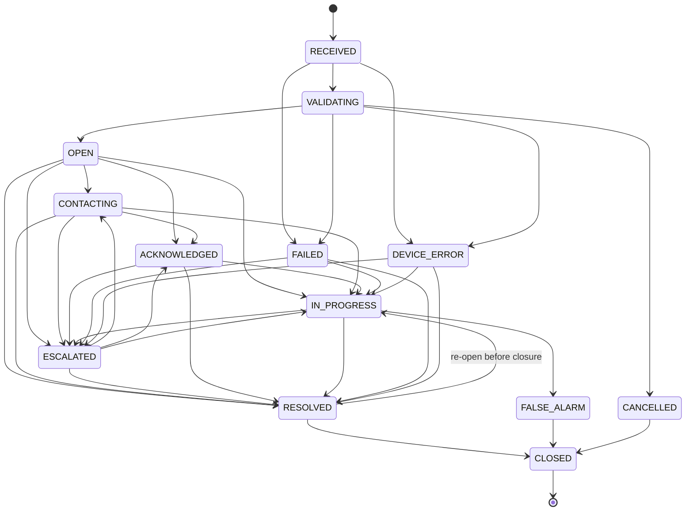

# Incident lifecycle

Source of truth: [`state_machine.py`](../../apps/backend/src/careos/modules/incident_engine/state_machine.py).
Every transition appends an `IncidentEvent` with `from_status` and `to_status`.

(`FALSE_ALARM` is reachable from every status that can reach `RESOLVED`; omitted above for legibility.)

## Status groups

| Group | Statuses | Meaning |
|---|---|---|
| Active | RECEIVED, VALIDATING, OPEN, CONTACTING, ACKNOWLEDGED, IN_PROGRESS, ESCALATED, FAILED, DEVICE_ERROR | on the live board; blocks a second incident for the same device |
| Awaiting closure | RESOLVED, FALSE_ALARM, CANCELLED | outcome recorded, waiting for review |
| Terminal | CLOSED | immutable history |

## Who moves an incident

| Transition | Actor | Trigger |
|---|---|---|
| RECEIVED → VALIDATING → OPEN / DEVICE_ERROR | Gateway (system) | device event accepted |
| OPEN → CONTACTING | Worker | first automated call / contact step starts |
| → ACKNOWLEDGED | Worker (provider result) | callee confirms (e.g. IVR "press 1") |
| → ESCALATED | Worker | `OPERATOR_ESCALATION` step (scheduled or fail-safe) |
| → IN_PROGRESS | Operator | take over (assignment created, automation halted) |
| → RESOLVED / FALSE_ALARM | Operator | resolution with category + notes |
| → CLOSED | Operator | closure after review |
| → FAILED | Worker | the operator-alert step itself failed permanently |

## Resolution categories

`USER_SAFE`, `CAREGIVER_RESPONDED`, `FAMILY_RESPONDED`, `FALSE_ALARM` (→ status `FALSE_ALARM`),
`EMERGENCY_SERVICES`, `DEVICE_ERROR`, `OTHER`.

## Escalation interaction

| Event | Effect on pending steps |
|---|---|
| Operator takeover | all pending steps cancelled (`ESCALATION_HALTED`) |
| Contact / service user acknowledges | pending call/notify steps cancelled; operator alert still runs (human verification) |
| Resolved / false alarm | all pending steps cancelled |
| Step failed after retries | fail-safe `OPERATOR_ESCALATION` due immediately |
| Step running when incident resolved | outcome recorded, no status change |
