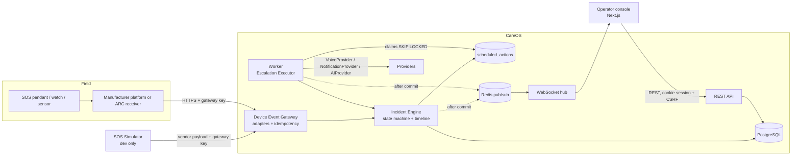

# CareOS architecture overview

CareOS receives alarms from care devices, turns them into incidents, runs an organisation's
escalation policy, shows operators a live board and records everything in an immutable trail.

**Product boundary:** CareOS does not diagnose, predict illness, recommend treatment or let AI
make safety decisions. The safety-critical core (Incident Engine + Escalation Engine) is
deterministic and keeps working when AI, Redis or notification providers are down.

## System context

## Runtime components

| Component | Tech | Scales by |
|---|---|---|
| `web` | Next.js 16 (standalone), React 19, TanStack Query | stateless replicas |
| `api` | FastAPI on Uvicorn | stateless replicas (Redis fan-out between them) |
| `worker` | asyncio loop, same image as `api` | replicas (row leases, `SKIP LOCKED`); for local development only it can run inside the API process (`CAREOS_EMBEDDED_WORKER=true`) |
| `postgres` | PostgreSQL 18 | managed HA instance |
| `redis` | Redis 8 (pub/sub, rate limiting) | managed instance; **not** a source of truth |

## Backend modules (`apps/backend/src/careos/modules`)

| Module | Owns |
|---|---|
| `organisations` | tenants, onboarding with a safe default policy |
| `identity` | users, server-side sessions, RBAC (`rbac.py`), principal |
| `service_users` | service users and trusted contacts (minimum necessary data) |
| `devices` | device registry and connection/telemetry snapshot |
| `device_gateway` | gateway credentials, manufacturer adapters, idempotency receipts |
| `incident_engine` | incidents, state machine, append-only timeline, takeover/resolve/close |
| `escalation_engine` | policies, durable scheduled actions, executor |
| `notification_engine` | `VoiceProvider`/`NotificationProvider` abstractions, calls, notifications |
| `ai_orchestrator` | `AIProvider` abstraction, timeouts, advisory sessions |
| `audit` | immutable audit log |
| `realtime` | WebSocket endpoint, hub, Redis broker |
| `simulator` | development-only virtual device platform |
| `dashboard` | operational counters |

## Key flows

* [Incident lifecycle and state machine](incident-lifecycle.md)
* [SOS end-to-end sequence](sos-sequence.md)
* Decisions: [docs/decisions](../decisions/README.md)

## Failure behaviour

| Failure | Effect | Mitigation |
|---|---|---|
| Redis down | realtime fan-out between processes stops | API delivers locally; consoles poll every 10 s; rate limiter falls back to in-memory |
| AI provider down / slow | no advisory note | timeout, `AI_CALL_FAILED` event, deterministic call proceeds |
| Voice provider down | call step fails | retries with backoff, then fail-safe operator alert |
| Worker crash mid-step | step lease expires | another worker reclaims; at-least-once call |
| Duplicate / concurrent device delivery | — | unique receipt, one incident |
| Two operators take over at once | — | row lock + partial unique index, one wins, other gets 409 |
| API instance crash during ingest | transaction rolls back, producer retries | receipt only committed with the incident |
| PostgreSQL down | ingestion fails with 5xx; `/ready` returns 503 | producers retry; managed HA/failover in production |

## Observability

* JSON logs (structlog) with `request_id` correlation, propagated from `X-Request-ID` through
  the simulator to the gateway; secrets and personal data keys are redacted.
* `/health` (liveness), `/ready` (PostgreSQL required; Redis reported), `/metrics` (Prometheus:
  HTTP, gateway events, incidents created, escalation actions, provider calls, WebSocket
  connections, realtime publish failures).
* Worker writes a heartbeat file for container health checks.
